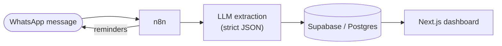

# Halketon — WhatsApp-first Operational Memory

MVP for **Halketon Track 1**: coordination and internal memory for NGO teams.

Halketon is not a replacement for WhatsApp or a full project-management suite. It is an
**operational memory layer** that converts everyday WhatsApp messages, meeting transcripts,
and reminders into structured tasks leadership can actually see.



> 📚 **Full documentation lives in [`docs/`](docs/README.md)** — architecture diagrams,
> data model, runtime flows, product definition, and the hackathon brief.

## Demo narrative

1. *(Optional)* A coordinator pastes a Meet/Zoom transcript on the dashboard → multiple tasks appear.
2. A team member sends a **private** WhatsApp message to the bot: `Yo hago el informe para el viernes`.
3. n8n receives the Twilio webhook and runs the task-extraction prompt.
4. The LLM returns strict JSON with owner, task, due date, status, priority, confidence.
5. Supabase stores the task.
6. The dashboard shows open work, overdue work, owners, and upcoming deadlines.
7. n8n sends **1:1** reminders and updates task status from quick replies.

> Channel model (1:1, not group) and how to obtain Meet/Zoom transcripts:
> [`docs/product/channel-and-transcripts.md`](docs/product/channel-and-transcripts.md)

## Documentation

| Doc | What's inside |
|---|---|
| [docs/](docs/README.md) | Documentation index — start here |
| [docs/architecture/overview.md](docs/architecture/overview.md) | Complete architecture: context, container, deployment & status diagrams |
| [docs/architecture/data-model.md](docs/architecture/data-model.md) | ERD + table/enum reference |
| [docs/diagrams/flows.md](docs/diagrams/flows.md) | Runtime sequence diagrams |
| [docs/product/mvp-definition.md](docs/product/mvp-definition.md) | Product thesis, users, features, demo script |
| [docs/product/hackathon-brief.md](docs/product/hackathon-brief.md) | Official challenge brief (3 tracks) |
| [docs/product/working-notes.md](docs/product/working-notes.md) | Team strategy & brainstorm |
| [docs/decisions/0001-mvp-stack.md](docs/decisions/0001-mvp-stack.md) | ADR: stack choice |
| [docs/decisions/0002-whatsapp-1-1-channel.md](docs/decisions/0002-whatsapp-1-1-channel.md) | ADR: 1:1 WhatsApp channel |
| [docs/product/channel-and-transcripts.md](docs/product/channel-and-transcripts.md) | Channel model + Meet/Zoom transcript paths |
| [docs/team/deployment.md](docs/team/deployment.md) | Deploy route (Supabase + Coolify) |

## Repository map

```text
apps/
  dashboard-web/       Next.js dashboard for leadership visibility
  n8n-workflows/       Importable/reference workflow definitions
database/
  schema.sql           Supabase/Postgres schema
  seeds.sql            Demo data
prompts/
  task-extraction.md   Strict-JSON WhatsApp → task prompt
  meeting-summary.md   Strict-JSON transcript → summary + tasks prompt
docs/                  All project documentation (see docs/README.md)
```

## Run the dashboard locally

```bash
cd apps/dashboard-web
npm install
npm run dev
```

Open `http://localhost:3000`. The dashboard uses local mock data
(`lib/mock-data.ts`) so the UI can be validated before Supabase and n8n are wired.

## MVP boundaries

**In scope**

- 1:1 WhatsApp capture through the Twilio Sandbox (private chat with the bot — not group automation).
- Natural-language task extraction when someone messages the bot directly.
- Meeting transcript → task extraction (paste in dashboard; export paths in docs).
- Reminder status updates via 1:1 quick replies.
- A simple leadership dashboard.

**Out of scope**

- WhatsApp group automation.
- Full project-management replacement.
- CRM / fundraising workflows.
- Complex auth, roles, permissions, multi-tenant setup.
- Enterprise integrations.

## Success criteria (demo)

- A WhatsApp message creates a structured task.
- The dashboard updates with task owner, deadline, and status.
- Overdue and upcoming tasks are visible.
- A reminder can update a task state.
- A meeting transcript creates multiple tasks.

## Implementation status

| Layer | State |
|---|---|
| DB schema + seeds | ✅ Complete |
| Prompt templates | ✅ Complete |
| Dashboard UI (mock data) | ✅ Complete |
| n8n task-capture / reminders | 🟡 Scaffolded (stubs) |
| Live Supabase reads / meeting flow | 🔴 Not started |

See [docs/architecture/overview.md §8](docs/architecture/overview.md#8-implementation-status-target-vs-today) for the full breakdown.
