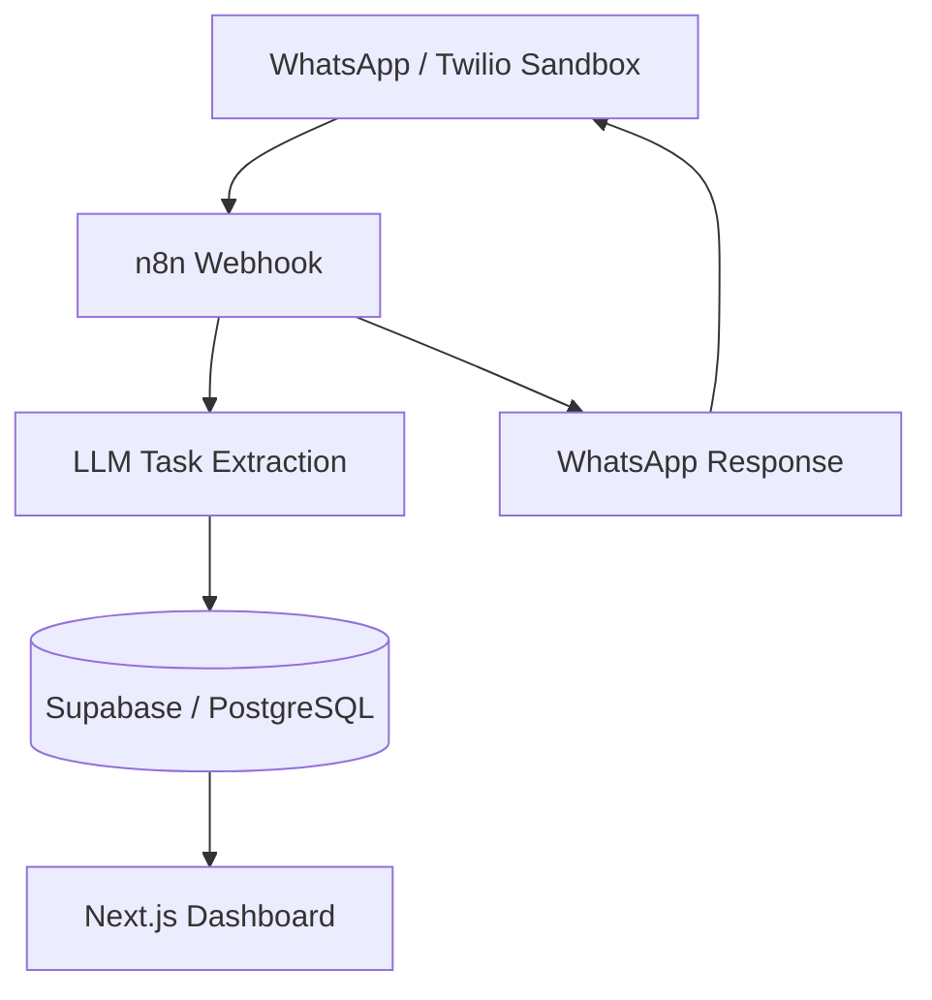
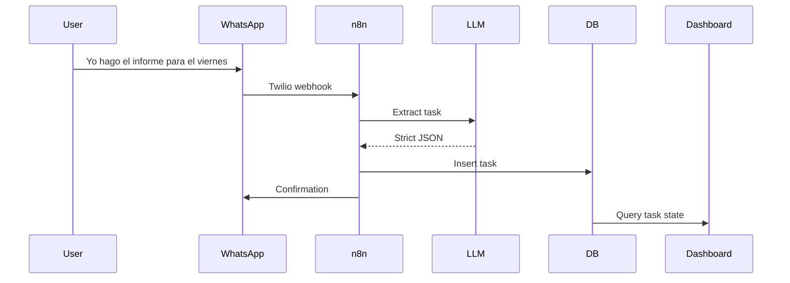
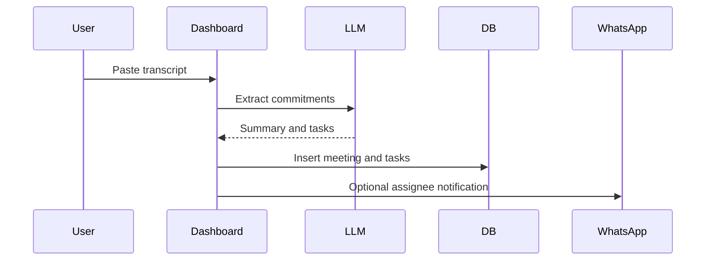
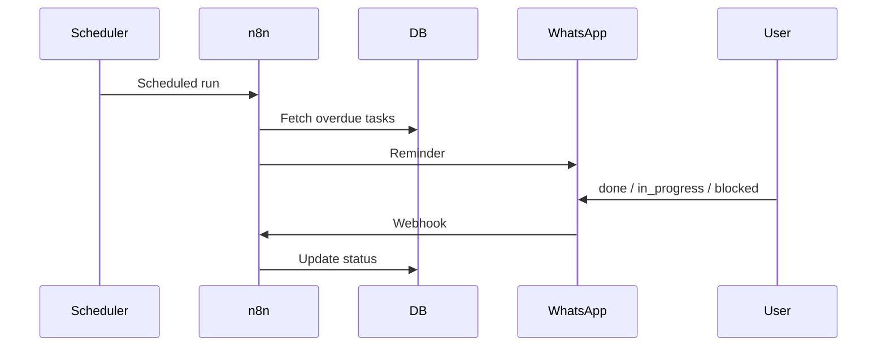

# Base Architecture

## System Shape

## Components

### Twilio WhatsApp Sandbox

Fastest WhatsApp path for the hackathon.

Responsibilities:

- Receive 1:1 WhatsApp messages.
- Forward message body and sender metadata to n8n.
- Send confirmations and reminders.

Tradeoff:

- No true WhatsApp group automation in the MVP.

### n8n

Orchestration only. n8n is not the business backend.

Responsibilities:

- Receive Twilio webhooks.
- Call LLM extraction.
- Validate strict JSON shape.
- Insert and update Supabase records.
- Send confirmations and reminders.

### LLM Layer

Responsibilities:

- Extract structured tasks from WhatsApp messages.
- Extract meeting summaries and commitments from transcripts.
- Return strict JSON only.
- Include confidence score and ambiguity flags.

### Supabase / Postgres

Source of truth for the MVP.

Tables:

- `people`
- `tasks`
- `meetings`
- `meeting_tasks`
- `reminders`
- `inbound_messages`

### Next.js Dashboard

Read-optimized interface for leadership.

Pages:

- `/dashboard`
- `/tasks`
- `/meetings`

The dashboard starts with mock data and can be switched to Supabase reads once the database is provisioned.

## Data Flow Boundaries

Task capture:

Meeting capture:

Reminder update:

## Security Defaults

- Store original source messages for traceability.
- Do not expose sender phone numbers in aggregate dashboard views unless needed.
- Treat message bodies as sensitive operational data.
- Keep LLM prompts deterministic and schema-bound.
- Separate raw inbound messages from normalized tasks.

