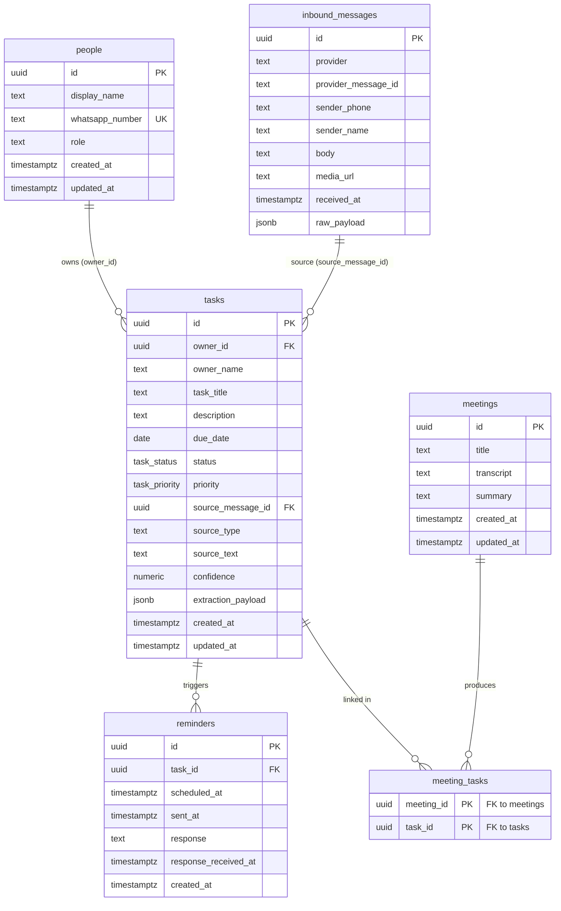
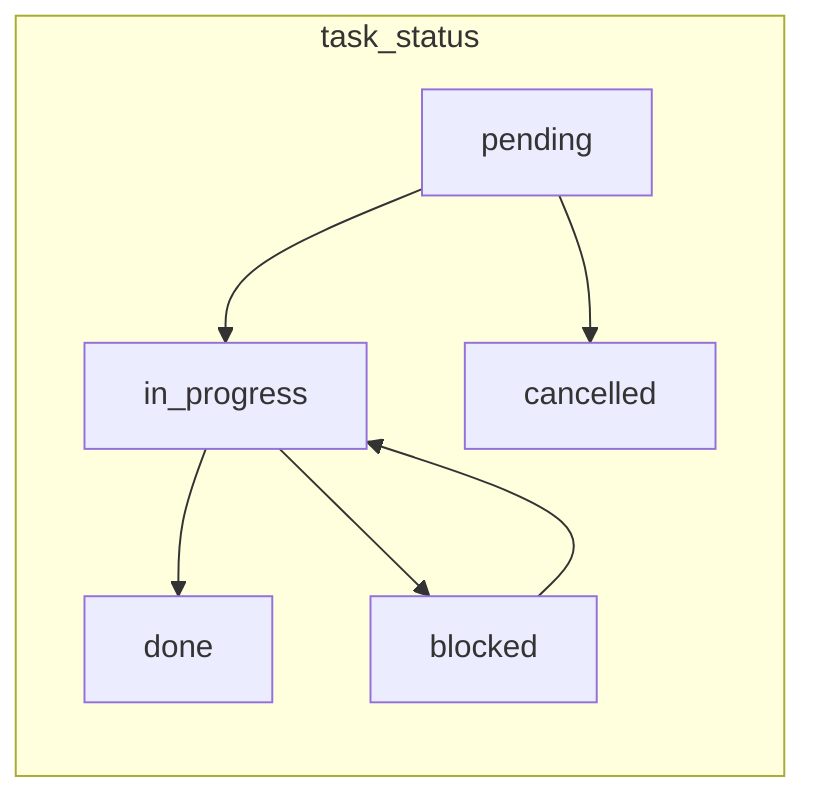

# Data Model

The durable source of truth is PostgreSQL (via Supabase). The full DDL lives in
[`../../database/schema.sql`](../../database/schema.sql); demo rows in
[`../../database/seeds.sql`](../../database/seeds.sql). This page is the human-readable
map of that schema.

---

## Entity-relationship diagram

---

## Tables

### `people`
Team members who can own tasks. `whatsapp_number` is unique and links a phone to a name.

### `inbound_messages`
Raw, append-only log of everything received from the messaging edge (default provider
`twilio`). Keeps `raw_payload` for traceability and debugging — deliberately separate
from normalized `tasks`.

### `tasks`
The core entity. Notable design choices:
- **Denormalized `owner_name`** alongside the `owner_id` FK, so a task survives even when
  the sender isn't yet a known `people` row (the LLM names a person before they exist).
- `source_type` (`whatsapp` / `meeting`) + `source_text` + `source_message_id` trace a task
  back to its origin.
- `confidence numeric(3,2)` is constrained to `0..1`; `extraction_payload` stores the raw
  LLM output for audit.

### `meetings` + `meeting_tasks`
A meeting holds a transcript and summary; `meeting_tasks` is the many-to-many join linking
a meeting to the tasks extracted from it (cascade delete on both sides).

### `reminders`
One row per scheduled nudge for a task. `sent_at` / `response` / `response_received_at`
track the lifecycle — these are the fields the reminder engine should use to **avoid
re-sending** the same reminder.

---

## Enums

- **`task_status`**: `pending`, `in_progress`, `blocked`, `done`, `cancelled`
- **`task_priority`**: `low`, `normal`, `high`, `urgent`

The status values map directly to the WhatsApp quick replies defined in
[`../../prompts/task-extraction.md`](../../prompts/task-extraction.md)
(`done` / `in_progress` / `blocked`).

---

## Conventions

- **Primary keys** are `uuid` via `gen_random_uuid()` (pgcrypto).
- **`updated_at`** is maintained automatically by the `set_updated_at()` trigger on
  `people`, `tasks`, and `meetings`.
- **Indexes**: `tasks(status)`, `tasks(due_date)`, `tasks(owner_name)`, and a partial index
  `reminders(scheduled_at) where sent_at is null` for fast due-reminder scans.
- **Deletes**: `people`/`inbound_messages` deletions null out the FK on `tasks`
  (`on delete set null`); meeting and reminder links cascade.
