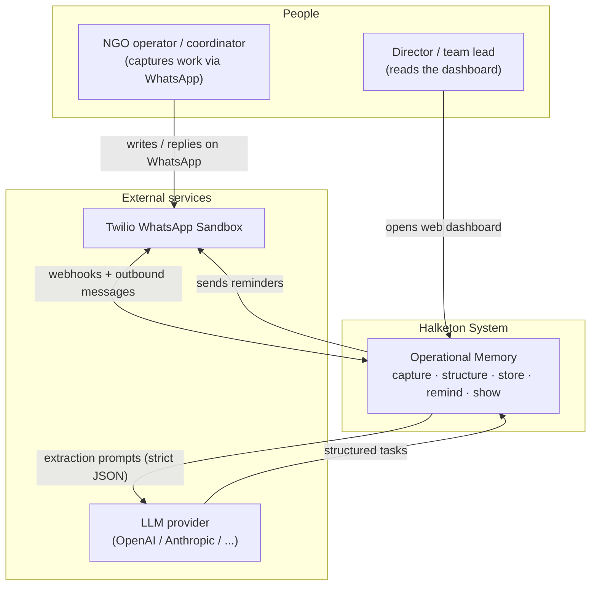
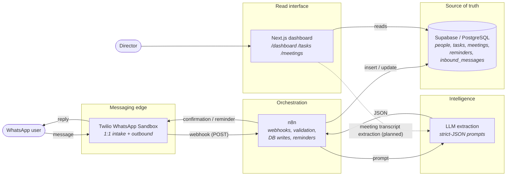
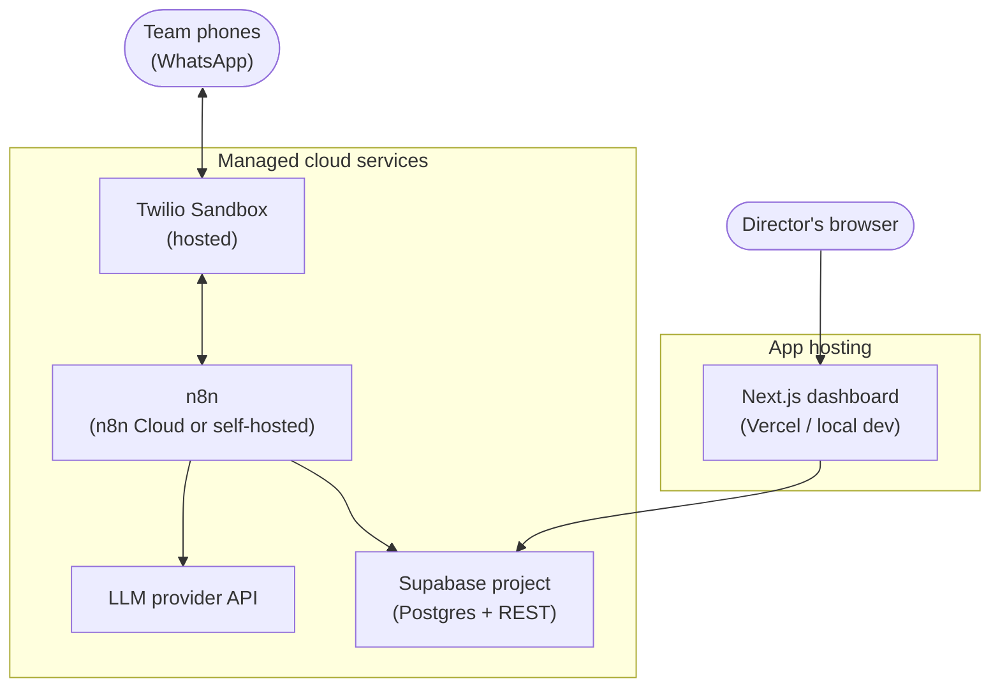
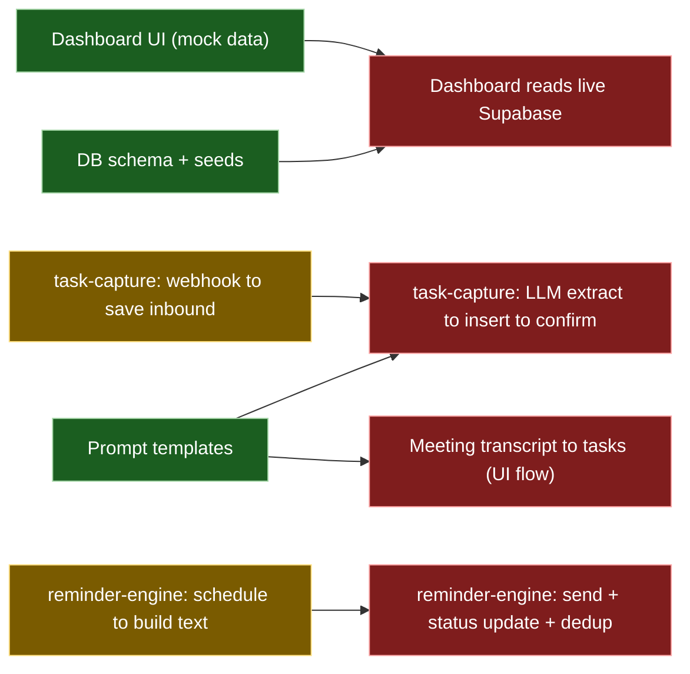

# Architecture Overview

> Halketon is a **WhatsApp-first operational memory layer** for NGO teams. It turns
> everyday WhatsApp messages and meeting transcripts into structured tasks that
> leadership can review on a simple dashboard.
>
> This document is the single source of truth for *how the system fits together*.
> For the product rationale see [`../product/mvp-definition.md`](../product/mvp-definition.md),
> for runtime sequences see [`../diagrams/flows.md`](../diagrams/flows.md), and for the
> database see [`data-model.md`](data-model.md).

---

## 1. The system in one sentence

A WhatsApp message → orchestration in **n8n** → structured extraction by an **LLM** →
durable storage in **Supabase/Postgres** → visibility through a **Next.js dashboard**,
with **n8n** closing the loop via reminders.

---

## 2. System context (Level 1)

Who and what the system talks to.



---

## 3. Container view (Level 2)

The runtime building blocks and how data moves between them.



---

## 4. Components and responsibilities

| Component | Tech | Responsibility | Explicit non-responsibility |
|---|---|---|---|
| **Messaging edge** | Twilio WhatsApp Sandbox | Receive 1:1 WhatsApp messages, forward body + sender metadata to n8n, send confirmations & reminders | No WhatsApp **group** automation in the MVP |
| **Orchestration** | n8n | Receive webhooks, call the LLM, validate strict JSON, insert/update Supabase, send outbound messages | Does **not** own business rules — it orchestrates only |
| **Intelligence** | LLM + prompt templates | Extract tasks from messages and commitments from transcripts; return strict JSON with a confidence score and ambiguity flags | Does **not** persist anything or make product decisions |
| **Source of truth** | Supabase / PostgreSQL | Durable, normalized state for people, messages, tasks, meetings, reminders | Does **not** parse raw text |
| **Read interface** | Next.js dashboard | Show leadership open/overdue work, load per person, upcoming deadlines, unowned tasks | Does **not** parse raw WhatsApp; reads structured data only |

These boundaries are the project's guardrails — see [ADR 0001](../decisions/0001-mvp-stack.md).

---

## 5. Technology stack

| Layer | Choice | Why (hackathon rationale) |
|---|---|---|
| Channel | Twilio WhatsApp Sandbox | Fastest WhatsApp path; lives on the channel NGOs already use |
| Orchestration | n8n | Visual, low-code wiring; easy to swap later |
| Extraction | LLM with strict-JSON prompts | Natural language in, structured data out, deterministic shape |
| Storage | Supabase / PostgreSQL | SQL source of truth, generous free tier, instant REST API |
| Dashboard | Next.js 16 (App Router) + React 18 | Simple read-optimized UI; starts on mock data |

---

## 6. Repository layout

```text
halketon/
├── README.md                     Project entry point + quick start
├── apps/
│   ├── dashboard-web/            Next.js leadership dashboard (reads mock data today)
│   │   ├── app/                  Routes: / /dashboard /tasks /meetings
│   │   └── lib/mock-data.ts      Demo data + dashboard summary logic
│   └── n8n-workflows/            Importable workflow definitions (reference)
│       ├── task-capture.workflow.json
│       └── reminder-engine.workflow.json
├── database/
│   ├── schema.sql                Postgres schema (enums, tables, triggers, indexes)
│   └── seeds.sql                 Demo data
├── prompts/
│   ├── task-extraction.md        Strict-JSON WhatsApp → task prompt
│   └── meeting-summary.md        Strict-JSON transcript → summary + tasks prompt
└── docs/
    ├── README.md                 Documentation index (start here)
    ├── product/                  MVP definition, hackathon brief, working notes
    ├── architecture/             This overview + data model
    ├── decisions/                Architecture Decision Records
    ├── diagrams/                 Runtime sequence flows
    └── reference/                Source PDF (base architecture & product definition)
```

---

## 7. Deployment view



Secrets are supplied as environment variables (see §9). No secrets are committed.

---

## 8. Implementation status (target vs. today)

The target architecture above is the destination. This is what is actually wired
**right now** — important for planning the hackathon build.



| Area | Status | Notes |
|---|---|---|
| Database schema + seeds | ✅ Complete | `database/schema.sql`, `database/seeds.sql` |
| Prompt templates | ✅ Complete | `prompts/*.md`, strict-JSON contracts |
| Dashboard UI | ✅ Complete (mock) | Reads `lib/mock-data.ts`; not yet wired to Supabase |
| `task-capture` workflow | 🟡 Partial | Stops at an LLM **placeholder node** — no extraction, insert, or confirmation yet |
| `reminder-engine` workflow | 🟡 Partial | Builds reminder text but has **no send node** and no dedup via `reminders` table |
| Live dashboard reads | 🔴 Not started | Swap `mock-data.ts` for Supabase queries |
| Meeting extraction flow | 🔴 Not started | Prompt + tables exist; UI/LLM wiring pending |

Legend: ✅ done · 🟡 partial · 🔴 not started.

---

## 9. Configuration & environment

Provided as environment variables to n8n (and Supabase to the dashboard once wired):

| Variable | Used by | Purpose |
|---|---|---|
| `SUPABASE_URL` | n8n, dashboard | Supabase REST endpoint |
| `SUPABASE_SERVICE_ROLE_KEY` | n8n | Server-side DB writes |
| `OPENAI_API_KEY` *(or chosen provider key)* | n8n | LLM extraction calls |
| `TWILIO_ACCOUNT_SID` | n8n | Twilio auth |
| `TWILIO_AUTH_TOKEN` | n8n | Twilio auth |
| `TWILIO_WHATSAPP_FROM` | n8n | Sandbox sender number |

---

## 10. Security & privacy defaults

- Store original source messages (`inbound_messages`) for traceability, separate from
  normalized `tasks`.
- Treat message bodies as sensitive operational data.
- Avoid exposing sender phone numbers in aggregate dashboard views unless needed.
- Keep LLM prompts deterministic and schema-bound; **validate JSON before insertion**.
- Hardening to add when moving past the sandbox: Twilio webhook signature validation
  and reminder de-duplication (tracked in §8).
