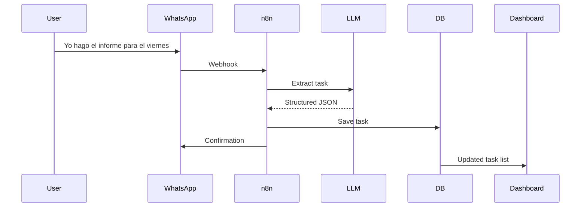
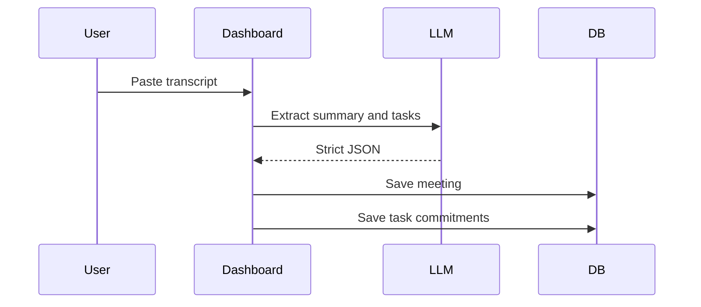
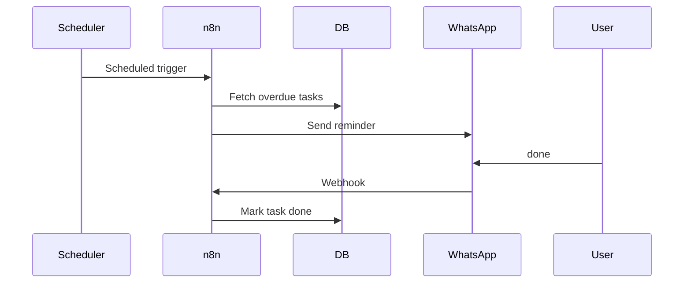

# Core Flows

## WhatsApp Task Creation

```mermaid
sequenceDiagram
  participant User
  participant WhatsApp
  participant n8n
  participant LLM
  participant DB
  participant Dashboard
  User->>WhatsApp: Yo hago el informe para el viernes
  WhatsApp->>n8n: Webhook
  n8n->>LLM: Extract task
  LLM-->>n8n: Structured JSON
  n8n->>DB: Save task
  n8n->>WhatsApp: Confirmation
  DB->>Dashboard: Updated task list
```

## Meeting Transcript Extraction

```mermaid
sequenceDiagram
  participant User
  participant Dashboard
  participant LLM
  participant DB
  User->>Dashboard: Paste transcript
  Dashboard->>LLM: Extract summary and tasks
  LLM-->>Dashboard: Strict JSON
  Dashboard->>DB: Save meeting
  Dashboard->>DB: Save task commitments
```

## Reminder Status Update

```mermaid
sequenceDiagram
  participant Scheduler
  participant n8n
  participant DB
  participant WhatsApp
  participant User
  Scheduler->>n8n: Scheduled trigger
  n8n->>DB: Fetch overdue tasks
  n8n->>WhatsApp: Send reminder
  User->>WhatsApp: done
  WhatsApp->>n8n: Webhook
  n8n->>DB: Mark task done
```

