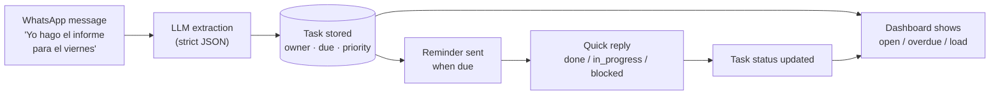
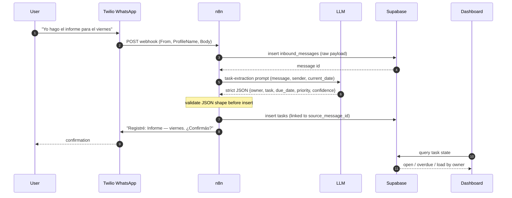
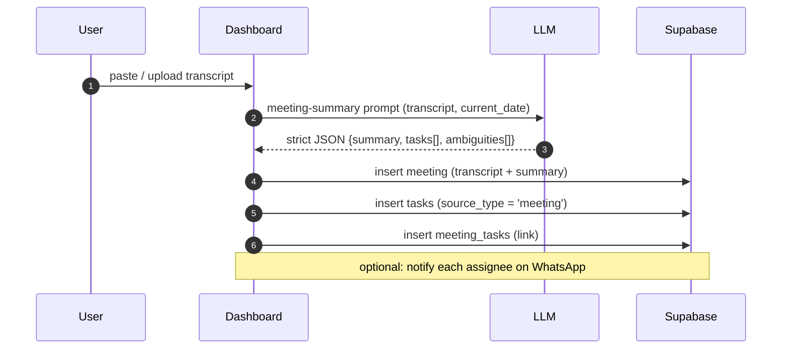
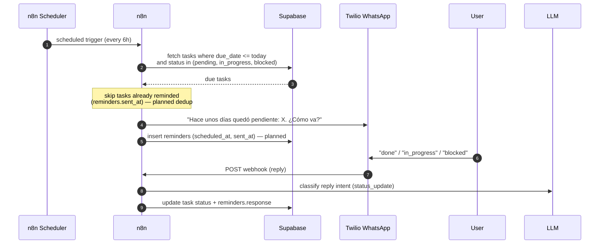

# Runtime Flows

Sequence diagrams for the system's runtime behavior. For the static structure see
[`../architecture/overview.md`](../architecture/overview.md); for tables see
[`../architecture/data-model.md`](../architecture/data-model.md).

> **Reading these:** solid arrows are calls/messages, dashed arrows are returns.
> Steps marked _(planned)_ are not yet wired — see the implementation status in the
> architecture overview, §8.

---

## End-to-end lifecycle

How a single commitment travels from a chat message to a closed task.

---

## 1. WhatsApp task creation

---

## 2. Meeting transcript extraction _(planned)_

---

## 3. Reminder + status update

### Quick-reply mapping

| Reply | Maps to |
|---|---|
| `done`, `hecho`, `listo`, `ok`, ✅ | `done` |
| `en proceso`, `sigo`, ⏳ | `in_progress` |
| `bloqueado`, `no puedo`, 🚫 | `blocked` |

Defined in [`../../prompts/task-extraction.md`](../../prompts/task-extraction.md).
