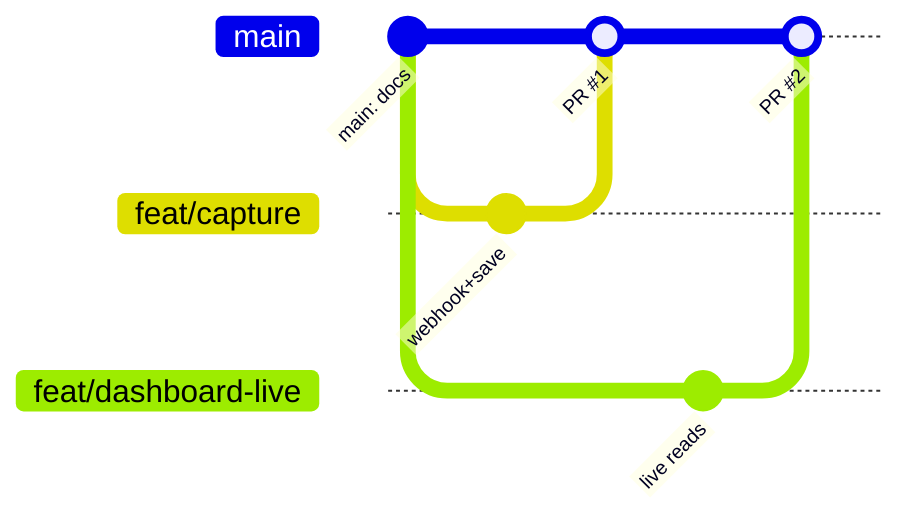

# Git Workflow

Tuned for a strong-git team of 4, co-located, shipping fast. Goal: **`main` is always
demoable**, and nobody is ever blocked waiting on a merge.

---

## Branch model — short-lived feature branches off `main`



- **`main`** is the trunk. Always deployable/demoable. Protected — no direct pushes (except a P1 hotfix during a live demo emergency).
- **Feature branches**, one per slice, short-lived (merge within ~2h):
  - `feat/capture` (P1) · `feat/reminders` (P2) · `feat/dashboard-live` (P3) · `feat/meetings` (P4)
  - Smaller follow-ups: `feat/<slice>-<thing>`, `fix/<thing>`, `chore/<thing>`, `docs/<thing>`.
- Branch **off the latest `main`**; rebase on `main` before opening the PR.

---

## Pull requests

- **Every change lands via PR into `main`.** No exceptions outside a live-demo hotfix.
- **Keep PRs small and frequent** — merge at least every ~2 hours. A giant end-of-day PR is how hackathons lose the last hour to conflicts.
- **No gatekeeper — peer glance, then author merges.** Co-located: ask any teammate for a quick look (~2 min, over the shoulder or in the PR), and once it's green and glanced, the **author merges their own PR**. This keeps everyone moving without a single bottleneck.
- **P4 owns trunk health overall** — not as a gate on every PR, but as the person who runs the end-to-end smoke check at each checkpoint and owns the final integration + freeze (below).
- **Run the unit tests for the package you touched before you open the PR** (`packages/core` and/or `apps/dashboard-web` — each has its own `npm test`; there's no root one). The pure-logic suite should be green (see [`testing.md`](testing.md)). It's part of the peer-glance, not a CI gate.
- PR description = one line: what it does + how you tested it (unit + smoke).

## Commits — conventional commits

`type: summary` where type is `feat` / `fix` / `docs` / `chore` / `refactor`.
Examples: `feat: wire LLM extraction in task-capture`, `fix: dedup reminders by sent_at`,
`docs: add meeting webhook contract`. (Matches history already in this repo.)

---

## Conflict protocol

1. The file-ownership map in [`roles-and-ownership.md`](roles-and-ownership.md) makes conflicts rare — slices live in different directories.
2. **Resolve conflicts on your branch, never on `main`.** Rebase your branch onto `main`, fix locally, force-push your branch, then the PR merges clean.
3. If two people must touch the same file, say it out loud *before* starting and split by function/section, or pair on it.
4. Pull/rebase from `main` whenever a teammate announces a merge.

```bash
# before opening a PR, get current and replay your work on top
git fetch origin
git rebase origin/main
# resolve any conflicts here, on your branch, then:
git push --force-with-lease
```

---

## Integration freeze (T-minus 2h)

Two hours before the demo, `main` enters **freeze**:
- Only `fix:` PRs merge — no new features.
- Anything not merged and smoke-passing by freeze is **cut** (see the cut list in [`timeline-and-checkpoints.md`](timeline-and-checkpoints.md)).
- P4 (integration owner) cuts a `demo-freeze` tag so there's a known-good fallback to demo from.

```bash
git tag demo-freeze && git push origin demo-freeze
```

---

## Secrets — never commit them

- Supabase keys, Twilio tokens, and LLM keys live in **n8n environment variables** and the dashboard's local `.env.local` (already git-ignored). 
- If a secret is committed by accident: tell the team immediately, rotate the key, and scrub it — don't just delete in a later commit.
