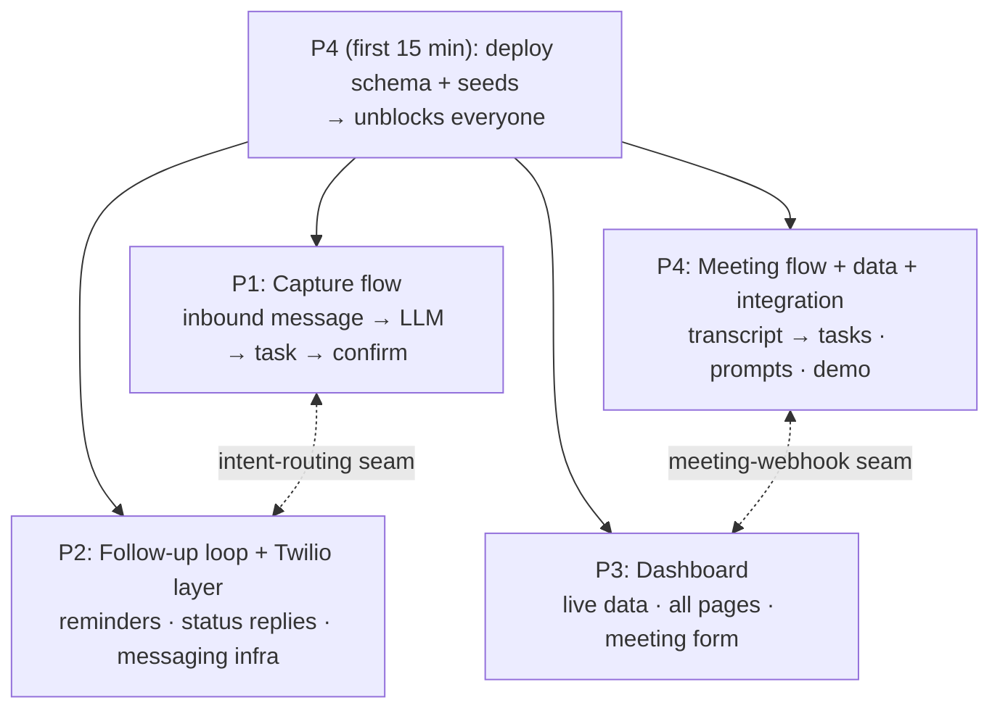

# Roles & Ownership

Four friends, in one room, building together for a day. Each person owns **one substantial,
comparably-sized chunk** so "who does what" is never fuzzy — but the silos are soft: we sit
together, so we pair on the tricky seams, swap when someone's stuck or bored, and everyone
swarms the critical path once their own piece lands. The plan is a backbone, not a cage.

See the system this maps onto in [`../architecture/overview.md`](../architecture/overview.md)
and the runtime flows in [`../diagrams/flows.md`](../diagrams/flows.md).

---

## How the work splits

The MVP is three flows over one shared foundation. We split so the load is even and each
person has a real deliverable:

There are exactly **two seams** where two people meet (marked above). Everything else is
independent. We agree both seam contracts at kickoff and then build either side of them
in parallel.

---

## The four roles

### P1 — Capture flow  *(backend/integration person)*
The single highest-value, highest-risk piece — so it's one person's whole focus, nothing
piled on top.

**Builds the inbound capture workflow in n8n:** receive a WhatsApp message → save
`inbound_messages` → call the LLM with `prompts/task-extraction.md` → validate the strict
JSON → branch on `intent`:
- `task_creation` → insert into `tasks` (linked to `source_message_id`) → send a WhatsApp confirmation.
- `status_update` → hand off to P2's status logic (the intent-routing seam).

**Pairs with:** P2 — they share the inbound webhook and the Twilio send. P2 hands P1 working
"pipes" (a webhook that fires, a send node that delivers), P1 builds the "brain" (extraction
+ insert). They sit next to each other.

### P2 — Follow-up loop + Twilio messaging layer  *(generalist)*
A real, owned domain: **everything about outbound/inbound WhatsApp messaging and the
follow-up loop.** This is infrastructure the other flows depend on *plus* a complete flow of
its own — substantial and clearly P2's.

**Builds:**
1. **Twilio messaging layer** — join/configure the sandbox, the outbound send node, and the inbound webhook plumbing. P1's capture and P2's reminders both use this; P2 is the owner so it's built once, well.
2. **`reminder-engine` workflow** — scheduled fetch of due tasks → send reminder → record in `reminders`, and **dedup** (skip tasks already reminded via `reminders.sent_at`).
3. **Status-reply branch** — when an inbound message is a `status_update`, map `done`/`in_progress`/`blocked` and update the task + the reminder's `response`. (This is the other half of the intent-routing seam with P1.)

### P3 — Dashboard  *(frontend/React person)*
Owns the entire read interface — a full person's worth of work, never blocked.

**Builds:**
- Swap `apps/dashboard-web/lib/mock-data.ts` for live Supabase reads on `/dashboard` and `/tasks` (keep the existing summary logic).
- Live `/meetings` list + the **meeting input form** that POSTs a transcript to P4's webhook and renders the result (the meeting-webhook seam).
- Demo polish — the dashboard is the face of the demo, so styling/empty-states/loading matter.

**Never blocked:** develops against `seeds.sql` from minute one. Owns *all* files under `apps/dashboard-web/`.

### P4 — Meeting flow + Data + Integration owner  *(SQL/data person)*
Front-loads the foundation, owns an independent flow, and — instead of a vague "float" —
takes the concrete **integration & demo owner** hat, which naturally ramps up at the end as
their build work stabilizes.

**Builds, in order:**
1. **First 15 min:** deploy `database/schema.sql` + `database/seeds.sql` to Supabase, announce "tables live." Unblocks P1, P2, P3.
2. **`meeting-capture` workflow** — webhook receives `{transcript}` → runs `prompts/meeting-summary.md` → inserts `meetings` + `tasks` + `meeting_tasks` → returns `{summary, tasks[]}`.
3. **Prompts** — owns both files in `prompts/`; extraction quality is a shared dependency everyone leans on.
4. **Integration & demo owner (back half of the day):** keeps `main` healthy, runs the end-to-end smoke check before each checkpoint, owns the demo environment + demo data, and tags the `demo-freeze`. This works because P4's foundation + meeting work front-loads, freeing them to integrate while others finish.

---

## Rough load balance

| Person | Primary deliverable | Weight |
|---|---|---|
| P1 | Capture workflow (inbound → task) | Heavy build, single focus |
| P2 | Twilio layer + reminders + status replies | Infra + one full flow |
| P3 | Whole dashboard + meeting form + polish | One full surface |
| P4 | Data + prompts + meeting flow + integration | Front-loaded build, then integration |

No one is a sidekick; no one is a pure floater. If reality drifts (P1's pipeline runs long,
P3 finishes early), we **rebalance out loud** — that's the advantage of sitting together.

---

## How we actually collaborate (we're in the same room)

- **Pair on the two seams.** P1+P2 on intent routing; P3+P4 on the meeting webhook. Agree the JSON shape, then split.
- **Swarm the critical path.** The moment your own piece is merged and smoke-passing, go help whatever's blocking the demo (usually the capture flow). Finishing your slice early ≠ done.
- **Talk before touching shared things.** Schema or prompt change? Say it out loud first — it's a contract others build on.
- **Swap if stuck or bored.** Two heads on a gnarly n8n node beats one person grinding for an hour. Trade tasks if it keeps the day fun — the role table is who's *accountable*, not who's *forbidden*.
- **Quick verbal syncs**, not formal standups: a 2-minute "where's everyone at?" at each checkpoint (see [`timeline-and-checkpoints.md`](timeline-and-checkpoints.md)).

---

## File-ownership map (conflict avoidance)

Slices map onto **different directories**, so merge conflicts are naturally rare. Stay in
your lane; coordinate on the two seams.

| Path | Owner |
|---|---|
| `apps/n8n-workflows/task-capture.workflow.json` | P1 |
| `apps/n8n-workflows/reminder-engine.workflow.json` | P2 |
| `apps/n8n-workflows/meeting-capture.workflow.json` *(new)* | P4 |
| `apps/dashboard-web/**` | P3 |
| `database/**` | P4 |
| `prompts/**` | P4 |
| `packages/core/**` *(shared pure logic + tests)* | **shared** — coordinate before editing |
| `docs/**` | anyone (small PRs) |

`packages/core/` is the one shared module: the TDD'd pure logic (normalizers, validators,
mappers) that n8n mirrors and the dashboard imports. See [`testing.md`](testing.md).

---

## Shared contracts (freeze early, change rarely)

These are the interfaces between people. Lock them in the first hour; changes are announced
out loud and go through the owner.

1. **DB schema** (`database/schema.sql`) — the contract between n8n (writers) and the dashboard (reader). Owner: P4. Develop everything against `seeds.sql`.
2. **LLM output JSON** (`prompts/*.md`) — the contract between the LLM and n8n's insert logic. Owner: P4. Shapes are already defined in the prompt files.
3. **Intent-routing seam** (P1 ↔ P2) — the inbound webhook detects `intent`; `task_creation` stays with P1, `status_update` calls P2's logic. Agree how the branch hands off (same workflow with a branch node, or P1 calls P2's sub-workflow).
4. **Meeting-webhook seam** (P3 ↔ P4) — request `{ transcript }`, response `{ summary, tasks[] }`. Owner: P4, consumer: P3. Meeting extraction lives in n8n (not the Next.js app) so LLM keys stay server-side and ownership stays clean.
