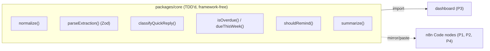

# Testing & TDD

We do **TDD for everything that is deterministic and pure** — and the right *other*
technique for everything that isn't. Blindly "TDD everything" breaks in this stack because
three of our pieces are not unit-testable by nature: **n8n** (visual workflows), the **LLM**
(non-deterministic), and **Twilio** (external network). The trick is to *pull the testable
logic out of those* and TDD it relentlessly.

> One-line rule: **if a function takes input and returns output with no I/O, TDD it.
> Everything else gets a contract test, an eval, or a smoke check.**

---

## 1. What is (and isn't) TDD-able here

| Part of the system | Technique | Why |
|---|---|---|
| Twilio payload → normalized object | **TDD (unit)** | Pure transform |
| Strict-JSON validator for LLM output | **TDD (unit)** | Pure; also the "validate before insert" guardrail |
| Quick-reply → status mapper (`done`/`in_progress`/`blocked`) | **TDD (unit)** | Pure branching logic |
| Due-date resolution / overdue & this-week math | **TDD (unit)** | Pure, edge-case heavy |
| Reminder dedup decision (`shouldRemind`) | **TDD (unit)** | Pure predicate |
| Dashboard aggregation (`getDashboardSummary`) | **TDD (unit)** | Pure, already exists untested |
| Dashboard presentational components | **TDD (component)** | Render + assert with RTL |
| Webhook request/response shapes (meeting seam) | **Contract test** | Both sides build to a shared schema |
| LLM extraction *quality* (prompts) | **Eval (golden cases)** | Non-deterministic — assert structure always, key fields with tolerance |
| n8n workflow wiring | **Smoke (manual)** | Visual, not code |
| Full WhatsApp round-trip (Twilio → … → reply) | **Smoke (manual)** | External, end-to-end |
| Supabase reads/writes | **Smoke + contract** | Network; mock in units, verify live in smoke |
| DB constraints / triggers | **Light SQL assertions** | Cheap to verify, low priority |

The testing pyramid for this project — **lots of fast pure-logic tests, few slow ones:**

```text
              ▲  fewer, slower, higher-confidence
       ┌──────────────┐
       │  Smoke / E2E │   manual checklist (Twilio round-trip)
     ┌────────────────────┐
     │ Contract · Component│   webhook shapes · RTL render
   ┌────────────────────────┐
   │   Unit (pure logic)  ◄──┤  ← TDD lives HERE. Most of our tests.
   └────────────────────────┘
              ▼  many, fast (<1s), deterministic
```

---

## 2. The "testable core" pattern (this is what makes TDD possible)

Pull every pure function into a framework-free module, `packages/core/`, and TDD it there.
n8n Code nodes and the dashboard both **use the same tested logic** — n8n by mirroring
(pasting) the function body, the dashboard by importing it.



Why a module the LLM/Twilio code can't import directly? Because the *value* is the tested
logic, not the wiring. n8n hosted Code nodes can't `npm install` our package, so we keep the
**canonical, tested implementation in the repo** and paste the (tiny) function body into the
node. The test guards the logic; the copy is trivial and reviewed in the PR.

> **Ownership note:** `packages/core/**` is **shared** (coordinate before editing), unlike
> the per-slice files. It's the one place all four of us contribute pure logic. See the
> file-ownership map in [`roles-and-ownership.md`](roles-and-ownership.md).

---

## 3. The TDD loop

**Red → Green → Refactor**, small steps:

1. **Red** — write one failing test that states the behavior you want. Run it; watch it fail for the *right* reason.
2. **Green** — write the *smallest* code that makes it pass. Ugly is fine.
3. **Refactor** — clean up with the test as your safety net. Re-run; stay green.

Rules that keep it honest:
- One behavior per test; name it after the behavior (`returns null for an unrelated message`).
- Arrange-Act-Assert structure.
- Test **behavior, not implementation** — assert outputs, not internal calls.
- A test you didn't watch fail is not trustworthy.
- Keep the whole unit suite **under ~1 second** so the loop is instant.

---

## 4. Tooling & setup

**Runner: [Vitest](https://vitest.dev)** (fast, native ESM/TS, great watch mode — ideal for
TDD). **Component tests: React Testing Library.** **Schemas: Zod** (the schema *is* the
contract, and it doubles as the runtime validator in n8n's insert step).

### 4a. `packages/core` (pure logic — Node env)

`packages/core/package.json`:
```json
{
  "name": "@halketon/core",
  "private": true,
  "type": "module",
  "scripts": { "test": "vitest run", "test:watch": "vitest" },
  "dependencies": { "zod": "3.23.8" },
  "devDependencies": { "vitest": "2.1.8" }
}
```
No config file needed — Vitest defaults to the Node environment, which is all pure logic
requires. Run `npm install && npm run test:watch` here and leave it open while you code.

### 4b. `apps/dashboard-web` (components — jsdom env)

Add to `apps/dashboard-web/package.json` scripts: `"test": "vitest run"`,
`"test:watch": "vitest"`. Dev deps:
```text
vitest  @vitejs/plugin-react  jsdom
@testing-library/react  @testing-library/jest-dom  @testing-library/user-event
```
`apps/dashboard-web/vitest.config.ts`:
```ts
import { defineConfig } from "vitest/config";
import react from "@vitejs/plugin-react";
import { fileURLToPath } from "node:url";

export default defineConfig({
  plugins: [react()],
  // Vitest does NOT read tsconfig `paths`. Mirror the `@/* -> ./*` alias
  // here, or tests that import `@/lib/mock-data` (see §7) won't resolve.
  resolve: {
    alias: { "@": fileURLToPath(new URL("./", import.meta.url)) },
  },
  test: {
    environment: "jsdom",
    globals: true,
    setupFiles: ["./vitest.setup.ts"],
  },
});
```
`apps/dashboard-web/vitest.setup.ts`:
```ts
import "@testing-library/jest-dom/vitest";
```

> Scaffold both in the first ~30 min (during the setup spike) so the loop is ready before
> anyone writes real logic. These are config snippets to paste — not committed yet.

---

## 5. Worked example — TDD the quick-reply mapper (P2)

The status mapping from [`../../prompts/task-extraction.md`](../../prompts/task-extraction.md)
is pure branching logic — the textbook TDD case.

**Step 1 — Red.** `packages/core/quick-reply.test.ts`:
```ts
import { describe, it, expect } from "vitest";
import { classifyQuickReply } from "./quick-reply";

describe("classifyQuickReply", () => {
  it.each([
    ["done", "done"], ["Listo!", "done"], ["✅", "done"],
    ["sigo", "in_progress"], ["en proceso", "in_progress"], ["⏳", "in_progress"],
    ["bloqueado", "blocked"], ["no puedo", "blocked"], ["🚫", "blocked"],
  ])("maps %j → %s", (input, expected) => {
    expect(classifyQuickReply(input)).toBe(expected);
  });

  it("returns null for an unrelated message", () => {
    expect(classifyQuickReply("hola, ¿cómo va todo?")).toBeNull();
  });
});
```
Run `npm run test:watch` → red (module doesn't exist yet).

**Step 2 — Green.** `packages/core/quick-reply.ts`:
```ts
export type TaskStatus = "pending" | "in_progress" | "blocked" | "done" | "cancelled";

// Order matters: first match wins.
const RULES: ReadonlyArray<readonly [TaskStatus, readonly string[]]> = [
  ["done", ["done", "hecho", "listo", "ok", "✅"]],
  ["in_progress", ["en proceso", "sigo", "⏳"]],
  ["blocked", ["bloqueado", "no puedo", "🚫"]],
];

export function classifyQuickReply(text: string): TaskStatus | null {
  const t = text.trim().toLowerCase();
  for (const [status, triggers] of RULES) {
    if (triggers.some((trigger) => t.includes(trigger))) return status;
  }
  return null;
}
```
Watch it go green.

**Step 3 — Refactor / extend.** Add edge cases as new red tests (e.g. `"ok, lo hago"` —
should that be `done`? decide, write the test, make it pass). The test file becomes the
living spec of the mapper's behavior. Then paste the function body into P2's n8n status
branch.

---

## 6. Worked example — TDD the LLM-output validator (P1 & P4)

This validator is also our **"validate strict JSON before insert" guardrail** — so it's
production code *and* a TDD target. `packages/core/validate.ts`:
```ts
import { z } from "zod";

export const TaskExtraction = z.object({
  intent: z.enum(["task_creation", "status_update", "unknown"]),
  owner: z.string().nullable(),
  task: z.string().nullable(),
  description: z.string().nullable().optional(),
  due_date: z.string().regex(/^\d{4}-\d{2}-\d{2}$/).nullable(),
  priority: z.enum(["low", "normal", "high", "urgent"]),
  status: z.enum(["pending", "in_progress", "blocked", "done", "cancelled"]),
  confidence: z.number().min(0).max(1),
  ambiguities: z.array(z.string()).default([]),
});
export type TaskExtraction = z.infer<typeof TaskExtraction>;

export function parseExtraction(raw: unknown): TaskExtraction {
  return TaskExtraction.parse(raw); // throws on bad shape — n8n catches & flags low-confidence
}
```
Tests assert the *contract*, written before/with the schema:
```ts
import { describe, it, expect } from "vitest";
import { parseExtraction } from "./validate";

const valid = {
  intent: "task_creation", owner: "Mateo", task: "Preparar informe",
  due_date: "2026-06-12", priority: "normal", status: "pending",
  confidence: 0.94, ambiguities: [],
};

describe("parseExtraction", () => {
  it("accepts a well-formed extraction", () => {
    expect(parseExtraction(valid).owner).toBe("Mateo");
  });
  it("rejects confidence outside 0..1", () => {
    expect(() => parseExtraction({ ...valid, confidence: 1.5 })).toThrow();
  });
  it("rejects a malformed due_date", () => {
    expect(() => parseExtraction({ ...valid, due_date: "viernes" })).toThrow();
  });
  it("rejects an unknown priority", () => {
    expect(() => parseExtraction({ ...valid, priority: "ASAP" })).toThrow();
  });
});
```
The same pattern gives P4 a `MeetingExtraction` schema (`{ summary, tasks[] }`) — which is
*also* the meeting-webhook contract with P3.

---

## 7. Worked example — characterize `getDashboardSummary` (P3)

`getDashboardSummary` already exists in `apps/dashboard-web/lib/mock-data.ts` with **no
tests** and date-boundary logic that's easy to break. Before swapping it to live Supabase
data, **wrap it in tests** (characterization), then refactor safely. Cases to cover:

- A task due *before* today counts as **overdue**, not this-week.
- A task due *exactly today* is **not overdue** and **is** in this-week.
- A task due in 8 days is in **neither** overdue nor this-week.
- `done` / `cancelled` tasks are excluded from `open`.
- A `null` owner increments `unowned` and groups under "Sin responsable".
- `loadByOwner` is sorted by `total` descending.
- `riskTasks` is capped at 5.

```ts
import { describe, it, expect } from "vitest";
import { getDashboardSummary, type Task } from "@/lib/mock-data";

const t = (over: Partial<Task>): Task => ({
  id: "x", ownerName: "A", title: "t", description: "", dueDate: null,
  status: "pending", priority: "normal", confidence: 1, source: "whatsapp", ...over,
});

it("excludes done/cancelled from open", () => {
  const s = getDashboardSummary([t({ status: "done" }), t({ status: "pending" })]);
  expect(s.open).toBe(1);
});
```
> Note: the function pins "today" to a fixed date for the demo. Keep that injectable (pass
> `today` as an argument) so tests are deterministic and the demo isn't frozen to one date —
> a small, test-driven refactor worth doing.

**Design for testability:** the pages currently import mock data directly, which makes them
hard to test. Extract **presentational components that take props** (`<TaskTable tasks={…}/>`,
`<MetricCard …/>`) and keep pages thin (page = fetch + pass props). Then:
```tsx
import { render, screen } from "@testing-library/react";
import { TaskTable } from "@/components/task-table";

it("shows 'Sin responsable' when a task has no owner", () => {
  render(<TaskTable tasks={[t({ ownerName: null, title: "Informe" })]} />);
  expect(screen.getByText("Informe")).toBeInTheDocument();
  expect(screen.getByText("Sin responsable")).toBeInTheDocument();
});
```

---

## 8. Testing the non-deterministic LLM (eval, not TDD)

You **cannot** red-green-refactor a prompt. Test it as an **eval** with golden cases:

- **Always assert structure** — every output must pass `parseExtraction` (deterministic).
- **Assert key fields with tolerance** — for a fixed `current_date` input, assert `owner`, `intent`, and resolved `due_date`; do **not** assert exact `task`/`description` wording.
- **Pin `current_date`** in the prompt input so relative-date resolution ("el viernes") is deterministic.
- **Run on demand**, not in the fast loop — it costs tokens and time.

Sketch (`prompts/eval/cases.json` + a small runner):
```jsonc
[
  { "message": "Yo hago el informe para el viernes", "current_date": "2026-06-04",
    "expect": { "intent": "task_creation", "owner_present": true, "due_date": "2026-06-05" } }
]
```
The runner calls the LLM per case, asserts `parseExtraction` passes, then checks the
`expect` keys. Treat failures as prompt-tuning signal, not a broken build.

---

## 9. Per-role testing guide

| Role | TDD (unit) | Eval / Contract | Smoke (manual) |
|---|---|---|---|
| **P1 — Capture** | `normalize()` Twilio payload, `parseExtraction()` | prompt eval (golden messages) | full inbound → task → confirm round-trip |
| **P2 — Follow-up loop** | `classifyQuickReply()`, `shouldRemind()` dedup predicate, due-task selector | — | reminder send + reply updates status, no dupes on re-run |
| **P3 — Dashboard** | `summarize()` / date math, presentational components (RTL) | — | live page renders Supabase data |
| **P4 — Meetings + Data** | `MeetingExtraction` Zod schema | meeting prompt eval; meeting-webhook contract; light DB-constraint SQL | transcript → meeting + tasks visible |

---

## 10. Conventions

- **Location:** `*.test.ts(x)` colocated next to the unit it tests (`quick-reply.ts` + `quick-reply.test.ts`).
- **Structure:** Arrange-Act-Assert. Table-driven (`it.each`) for mappers/validators.
- **No real I/O in unit tests:** never hit Twilio/Supabase/the LLM from a unit test. Pass data in; mock at the boundary. Network belongs in smoke.
- **Determinism:** inject `today`/`current_date`; never depend on the wall clock or `Math.random`.
- **Speed:** the pure-logic suite stays under ~1s. If it's slow, something is doing I/O it shouldn't.
- **Run before you PR:** `npm test` green (in whichever package you touched — `packages/core` and/or `apps/dashboard-web`) is part of the peer-glance (see [`git-workflow.md`](git-workflow.md)). It's not a CI gate — keep it light.

---

## 11. Definition of Done (testing dimension)

A slice is done when its **pure logic has passing unit tests, it's merged, and it
smoke-passes** (see the per-slice DoD and smoke checklist in
[`timeline-and-checkpoints.md`](timeline-and-checkpoints.md)). "Tests green" means the
deterministic core is covered — *not* that we chased a coverage number.

---

## 12. Anti-patterns (don't)

- ❌ TDD the n8n workflow JSON or the page layout/CSS. Smoke those.
- ❌ Assert the LLM's exact wording. Assert structure + key fields.
- ❌ Hit real Twilio/Supabase/LLM in a unit test. Mock the boundary.
- ❌ Chase a coverage percentage. Cover the branching logic that breaks silently.
- ❌ Test the framework (that Next renders, that Zod validates). Test *your* behavior.
- ❌ Write five tests before any green. One red → green → next.

---

## 13. Hackathon reality

You won't TDD *everything* — you'll TDD everything **worth** it in 10 hours, which is the
pure logic with real edge cases: validators, mappers, date math, dedup, aggregation. Those
break silently and ruin demos; tests there pay for themselves. The glue (n8n wiring, Twilio,
layout) is covered by the smoke checklist. If you're behind, the unit tests for core logic
**stay** — they're faster than debugging a broken demo live.
