# Timeline, Checkpoints & Demo

A ~10-hour plan with three checkpoints. Times are offsets from kickoff (H0). Adjust to your
actual start time. The point of checkpoints: **catch "we're behind" early, while there's
still time to cut.**

---

## Hour-by-hour

```mermaid
gantt
  dateFormat HH:mm
  axisFormat %H:%M
  title Halketon hackathon day (~10h)

  section Setup
  Kickoff + lock decisions      :a1, 00:00, 30m
  Setup spike (P1+P2 pair)      :a2, 00:30, 45m
  Schema+seeds live (P4)        :a3, 00:30, 15m

  section Build to slice 1
  Parallel build               :b1, 01:15, 2h45m
  CHECKPOINT 1                  :milestone, c1, 04:00, 0m

  section Build remaining
  Reminders + meetings + polish :b2, 04:00, 3h
  CHECKPOINT 2                  :milestone, c2, 07:00, 0m

  section Land it
  Integration + bugfix          :d1, 07:00, 1h
  FREEZE (T-2h)                 :milestone, f1, 08:00, 0m
  Bugfix-only + demo data       :d2, 08:00, 1h
  Demo rehearsal + buffer       :d3, 09:00, 1h
```



### H0–0:30 — Kickoff (everyone)
- Lock the decisions from [`README.md`](README.md): names→roles, **one** LLM provider, confirm Supabase/n8n/Twilio reachable, demo phone joins the Twilio sandbox.
- Agree the **meeting webhook contract** (`{transcript}` → `{summary, tasks[]}`).
- Create the four feature branches.

### H0:30–1:15 — Setup spike
- **P4:** deploy `schema.sql` + `seeds.sql`. Announce "tables live" (~15 min). Then start `meeting-capture`.
- **P1 + P2 pair:** wire n8n credentials (Supabase service-role, Twilio, LLM key), get the Twilio webhook hitting n8n, confirm one raw message lands in `inbound_messages`.
- **P3:** install deps, connect the dashboard to Supabase, render `seeds.sql` data live (no waiting on the pipeline). Scaffold the Vitest + `packages/core` test harness (~15 min, per [`testing.md`](testing.md) §4) so the TDD loop is ready for everyone.

### H1:15–4:00 — Parallel build to the first full slice
- P1: finish capture (LLM → validate → insert task → confirm).
- P2: scheduled fetch of due tasks → send reminder → record in `reminders`.
- P3: live `/dashboard` + `/tasks`; start the meeting form.
- P4: `meeting-capture` workflow inserting `meetings`+`tasks`+`meeting_tasks`; tune prompts.

### H4:00 — ✅ Checkpoint 1: "the floor works"
A real WhatsApp message creates a task that appears on the live dashboard. If this isn't
working, **stop adding features** — everyone converges on the capture slice until it is.

### H4:00–7:00 — Remaining flows
- P2: status-reply branch + reminder dedup.
- P3 + P4: meeting form end-to-end (form → webhook → tasks visible).
- P1: harden the capture flow, then swarm the critical path.
- P4: starts the integration-owner role — smoke checks, keeping `main` healthy.

### H7:00 — ✅ Checkpoint 2: "all three flows demoable"
Honest status per flow. Decide what (if anything) gets cut. Begin integration pass.

### H8:00 — 🔒 Integration freeze (T-2h)
`main` is bugfix-only. P4 tags `demo-freeze`. Unmerged/un-smoked work is cut.

### H8:00–10:00 — Land it
- Load realistic **demo data** (not just seeds — a couple of believable tasks/people).
- Rehearse the demo runbook below at least twice.
- Keep ~1h buffer. Something will break; the buffer is not optional.

---

## Definition of Done (per slice)

A slice is "done" only when its **pure logic has passing unit tests** (see
[`testing.md`](testing.md)), it's **merged to `main`**, and it's **smoke-passing**:

- **Capture (P1):** sending a WhatsApp message creates a `tasks` row with owner/due/priority and the sender gets a confirmation reply.
- **Follow-up loop (P2):** Twilio send works; a due task triggers exactly one reminder (no duplicates on re-run); replying `done`/`in_progress`/`blocked` updates the task.
- **Dashboard (P3):** `/dashboard` and `/tasks` show live Supabase data (open/overdue/load/this-week), no mock import remaining.
- **Meetings (P4+P3):** pasting a transcript creates a `meetings` row plus multiple linked `tasks` visible on the dashboard.

---

## End-to-end smoke checklist (P4, integration owner, runs before each checkpoint)

```text
[ ] Send "Yo hago el informe para el viernes" on WhatsApp
[ ] inbound_messages row created
[ ] tasks row created with owner + due_date + confidence
[ ] confirmation reply received on WhatsApp
[ ] task visible on /dashboard and /tasks
[ ] trigger reminder workflow → reminder received
[ ] reply "done" → task status flips to done on dashboard
[ ] re-run reminder workflow → no duplicate reminder
[ ] paste a transcript on /meetings → meeting + multiple tasks appear
```

---

## Demo runbook (~3 min)

1. **Hook (15s):** "NGOs drown in WhatsApp. Halketon turns those messages into a memory leadership can see."
2. **Capture (45s):** send a real WhatsApp message live → show the confirmation → show it appear on the dashboard.
3. **Visibility (30s):** dashboard — open/overdue, load by person, unowned, this-week.
4. **Loop (45s):** trigger a reminder → reply `done` on the phone → dashboard updates.
5. **Meetings (30s):** paste a transcript → multiple tasks land.
6. **Close (15s):** same engine serves Track 1 (tasks) and could serve Track 3 (beneficiaries). Onboarding = adding a WhatsApp contact.

Have a **screen recording of the smoke checklist passing** as a fallback in case live WhatsApp/network fails during the demo.

---

## Cut list (if behind — cut in this order)

Even though the goal is everything, protect the demo by cutting from the bottom up:

1. **Reminder dedup** — accept possible duplicate reminders for the demo.
2. **Inbound status-update via reply** — demo status changes via dashboard or DB instead.
3. **Meeting extraction** — drop to "tasks come from WhatsApp only."
4. **Confirmation reply** — task still gets created, just no WhatsApp ack.

**Never cut:** WhatsApp message → task → visible on live dashboard. That is the MVP floor and the core of the demo.
